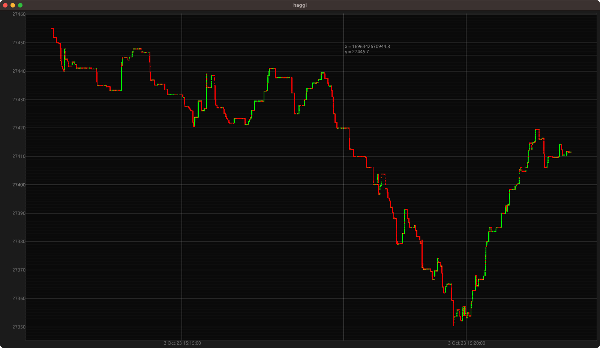
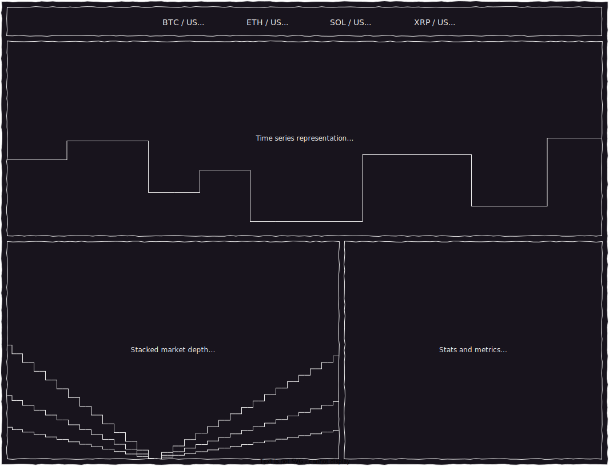

# haggl: visualise market data streams

## Quickstart

To dump BTC spot trade data from Binance to the console run

```sh
cargo run -- inspect btc  # or eth, sol, xrp
```

Or, to display the trades in a gui, run

```sh
cargo run --release -- gui btc  # or eth, sol, xrp
```



Red dots are seller initated trades, green are buyer initiated. If you want to know the size... that's a damn shame - version `0.1.0` is dead simple.

## What's next?

The next milestone is to display timeseries and market depth data for a **single pair**
(out of a few options) across **multiple venues**, along with some diagnostic information about the exchange connections and summary statistics about the data.

Something like this:



Beyond that there are many interesting directions to extend but I don't want to make any
specific promises.

## Key dependencies

haggl uses [actix](https://github.com/actix/actix) to manage the data flow from exchanges into the app, and [egui](https://github.com/emilk/egui/) for presentation.
